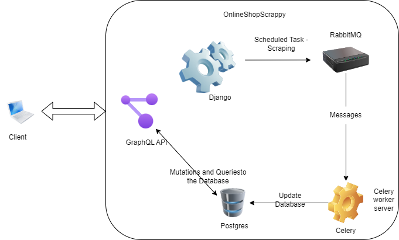

# OnlineShopScrapy

OnlineShopScrapy is a web application built using Django that implements a GraphQL API. The application performs scheduled scraping of an online website and stores the scraped data into a database. The app enalbes access to the scraped data through an API provided by the website. This Markdown file provides an overview of the project, including the system architecture and installation instructions.

## System Architecture

The system architecture of OnlineShopScrapy is designed to efficiently scrape data from the online website and store it in a database. It leverages the following technologies:

- **Django**: The web application framework used for building OnlineShopScrapy and handling HTTP requests/responses.
- **GraphQL**: An API query language and runtime used to provide a flexible and efficient interface for accessing the scraped data.
- **RabbitMQ**: A message broker that enables distributed task processing and communication between different components of the system.
- **Celery**: A distributed task queue system that allows for asynchronous execution of tasks.
- **Celery Beat**: A Celery extension for scheduling periodic tasks.
- **Flower**: A real-time web-based monitoring tool for Celery.

The overall system architecture can be visualized as follows:



The application performs scheduled tasks. These actions performing the web scraping. Once successfully scraped the data is stored in the database. 


### Installation

To install and run OnlineShopScrapy, follow these steps:

1. Clone the repository, clone the development branch to leverage the architecture discussed above.

2. Navigate to the project directory 

3. Run the application using docker compose
    ``` docker-compose up ```

By using docker we are able to create the disctinctive 
* Django Web App, RabbitMQ Server, Celery Server, Postgres Server


The main branch uses python's APScheduler Module to schedule the scraping.